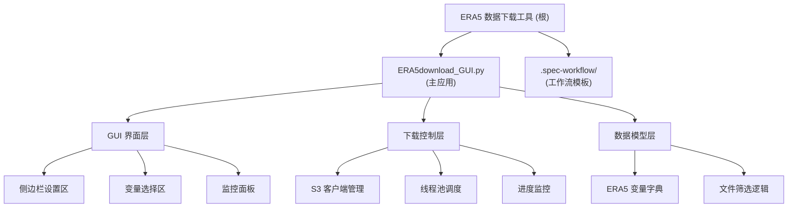

# ERA5 数据下载工具

> **最后更新**: 2026-01-19 20:38:39
> **项目类型**: Python GUI 应用程序

## 变更记录 (Changelog)

| 日期 | 版本 | 变更内容 | 作者 |
|------|------|----------|------|
| 2026-01-19 | 1.0.0 | 初始化项目文档结构 | AI架构师 |

---

## 项目愿景

ERA5 数据下载工具是一个基于 Python 和 CustomTkinter 的图形化数据下载客户端，旨在简化从 NCAR AWS S3 存储桶批量下载 ERA5 再分析数据的过程。项目提供了直观的 GUI 界面，支持变量筛选、多线程并发下载、实时进度监控和断点续传等功能，专注于提升气象数据获取的效率和用户体验。

---

## 架构总览

### 技术栈

- **GUI 框架**: CustomTkinter (现代化 Tkinter 主题)
- **网络传输**: Boto3 (AWS SDK for Python) + S3 协议
- **并发模型**: ThreadPoolExecutor (线程池)
- **数据源**: NSF-NCAR ERA5 公开 S3 存储桶 (`nsf-ncar-era5`)

### 核心特性

1. **变量筛选**: 支持按类别选择动力/热力学、湿度/云物理、化学成分等变量
2. **多线程下载**: 可配置 1-10 个并发线程，支持速度监控
3. **智能续传**: 自动检测本地文件完整性，跳过已下载文件
4. **优雅停止**: 支持中断下载并清理临时文件（`.tmp` 后缀）
5. **实时监控**: 显示每线程下载进度、速度统计和系统日志

### 架构模式

- **MVC 变体**: 单文件集成 Model（数据逻辑）、View（GUI 组件）、Controller（事件处理）
- **异步设计**: 下载任务在独立线程运行，通过 `after()` 回调更新 UI
- **生产者-消费者**: 使用队列管理线程槽位，确保资源可控

---

## 模块结构图



---

## 模块索引

| 模块路径 | 语言 | 职责描述 | 状态 | 文档 |
|---------|------|----------|------|------|
| `ERA5download_GUI.py` | Python | 主应用程序（GUI + 下载逻辑） | ✅ 核心模块 | [查看](./ERA5download_GUI.py/CLAUDE.md) |
| `.spec-workflow/` | Markdown | 工作流模板（需求/设计/任务等） | 📄 文档资源 | - |

**说明**:
- ✅ 核心模块: 包含主要业务逻辑
- 📄 文档资源: 配置或模板文件
- 🔧 工具模块: 辅助功能
- 🧪 测试模块: 单元测试或集成测试

---

## 运行与开发

### 环境要求

```bash
# Python 版本
Python >= 3.8

# 核心依赖
customtkinter >= 5.0.0
boto3 >= 1.28.0
```

### 快速启动

```bash
# 1. 安装依赖
pip install customtkinter boto3

# 2. 运行应用
python ERA5download_GUI.py
```

### 使用流程

1. **设置日期**: 输入目标年月（格式 `YYYYMM`，如 `202510`）
2. **选择目录**: 点击"选择文件夹"设置数据保存根目录
3. **选择变量**: 勾选需要下载的 ERA5 变量（不选则下载全部）
4. **配置线程**: 拖动滑块设置并发线程数（1-10，推荐 5）
5. **开始下载**: 点击"开始下载"按钮，监控实时进度
6. **停止/关闭**: 点击"停止并关闭"会清理所有 `.tmp` 临时文件

### 开发指南

- **添加新变量**: 编辑 `ERA5_VARS` 字典，按类别添加变量代码和描述
- **调整线程池**: 修改 `thread_slider` 的 `from_` 和 `to` 参数
- **自定义主题**: 修改 `ctk.set_default_color_theme()` 或 `fg_color` 参数

---

## 测试策略

**当前状态**: ❌ 无测试覆盖

### 测试缺口

1. **单元测试**: 缺少对核心函数的单元测试
   - `get_selected_vars()`: 变量选择逻辑
   - `stop_download()`: 临时文件清理逻辑
   - `download_one()`: 单文件下载流程

2. **集成测试**: 缺少端到端测试
   - S3 连接与文件列表获取
   - 多线程并发下载
   - 断点续传机制

3. **UI 测试**: 缺少 GUI 交互测试
   - 按钮响应与状态切换
   - 进度条更新准确性

### 建议补充

```bash
# 推荐测试框架
pytest >= 7.0.0
pytest-qt >= 4.0.0  # GUI 测试
pytest-mock >= 3.10.0  # Mock AWS S3 调用
```

---

## 编码规范

### 代码风格

- **命名约定**:
  - 类名: 大驼峰 (`ERA5CleanStopApp`)
  - 方法/函数: 蛇形 (`get_selected_vars`)
  - 常量: 全大写蛇形 (`ERA5_VARS`)
- **导入顺序**: 标准库 → 第三方库 → 本地模块
- **注释**: 关键逻辑添加中文注释，复杂函数添加文档字符串

### 最佳实践

1. **线程安全**: 使用 `threading.Lock()` 保护共享变量（如 `total_bytes`）
2. **资源清理**: 停止下载时强制清理临时文件并关闭网络连接
3. **错误处理**: 下载失败不中断整体任务，记录状态到 UI
4. **UI 响应**: 长时间任务使用独立线程，通过 `after()` 更新 UI

### 代码质量工具

**当前状态**: ❌ 未配置

建议添加：
```bash
# 代码格式化
black >= 23.0.0

# 代码检查
pylint >= 2.17.0
# 或
ruff >= 0.1.0  # 更快的替代方案

# 类型检查
mypy >= 1.0.0
```

---

## AI 使用指引

### 与 AI 协作的建议

1. **重构建议**:
   - 将 `ERA5CleanStopApp` 拆分为多个小类（如 `Downloader`, `UIBuilder`, `Monitor`）
   - 提取 S3 配置和变量字典到独立配置文件
   - 添加日志系统替代 `print()` 语句

2. **功能扩展**:
   - 支持批量下载多个月份
   - 添加下载历史记录和统计
   - 实现命令行接口（CLI）模式

3. **性能优化**:
   - 使用 `asyncio` 替代线程池（需验证 Boto3 兼容性）
   - 添加断点续传配置文件（记录未完成任务）
   - 实现分块下载和校验

4. **文档需求**:
   - 补充 API 文档（如变量字典的完整定义）
   - 添加常见问题解答（FAQ）
   - 编写用户手册（包含截图和示例）

### 上下文优先级

当与 AI 讨论此项目时，建议优先提供以下上下文：

1. **核心文件**: `ERA5download_GUI.py` 的完整代码
2. **依赖环境**: Python 版本、`pip list` 输出
3. **使用场景**: 具体下载的变量类型、数据量、网络环境
4. **错误信息**: 完整的堆栈跟踪和日志输出

---

## 项目统计

- **总文件数**: 8
- **代码文件**: 1 (Python)
- **文档文件**: 8 (Markdown)
- **代码行数**: ~389 行（主应用）
- **语言分布**: Python 100%

---

## 相关资源

- **ERA5 官方文档**: https://www.ecmwf.int/en/forecasts/datasets/reanalysis-datasets/era5
- **NCAR AWS S3 访问**: https://data.nccs.nasa.gov/thornes/ERA5/
- **CustomTkinter 文档**: https://customtkinter.tomschimansky.com/
- **Boto3 S3 客户端**: https://boto3.amazonaws.com/v1/documentation/api/latest/reference/services/s3.html

---

## 下一步建议

1. **短期**:
   - 添加 `requirements.txt` 依赖清单
   - 编写单元测试覆盖核心逻辑
   - 补充 `README.md` 使用说明

2. **中期**:
   - 重构代码为模块化结构（分离 GUI/下载/配置）
   - 添加日志系统（使用 `logging` 模块）
   - 实现命令行参数支持

3. **长期**:
   - 发布到 PyPI（作为可安装包）
   - 支持更多数据源（如 ERA5-Land）
   - 开发 Web 版本（使用 FastAPI + Vue）

---

*本文档由 AI 架构师自动生成，最后扫描时间: 2026-01-19 20:38:39*
